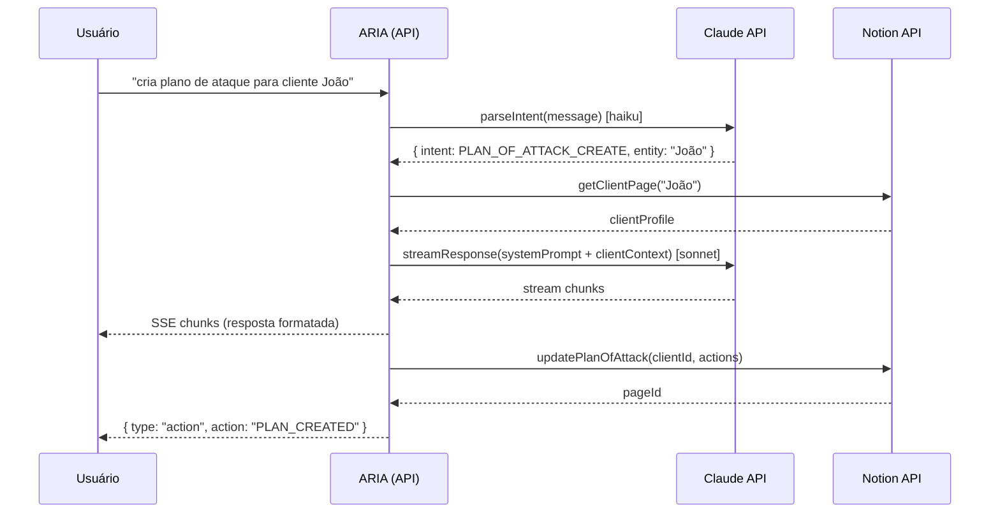
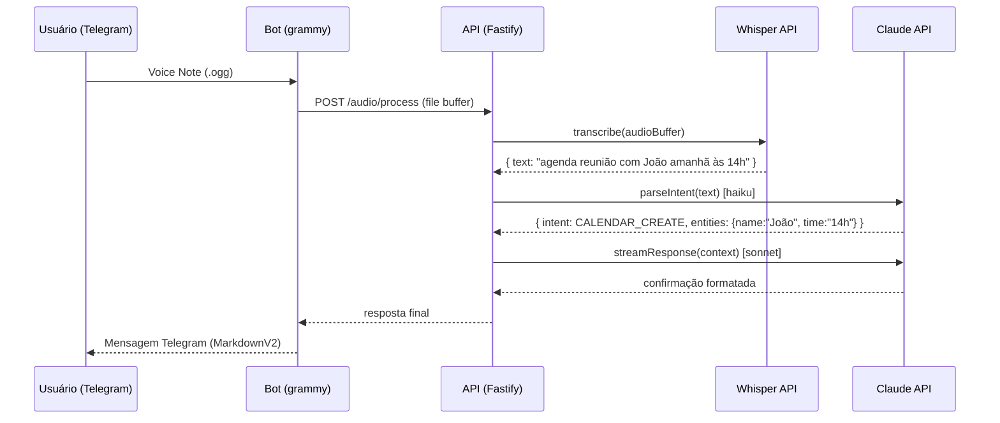
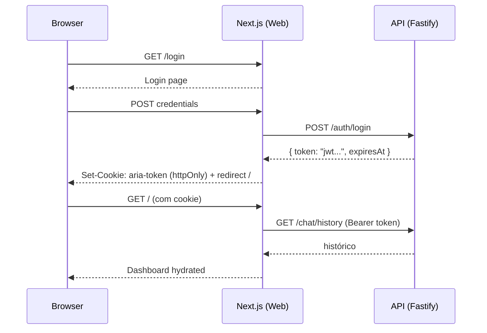
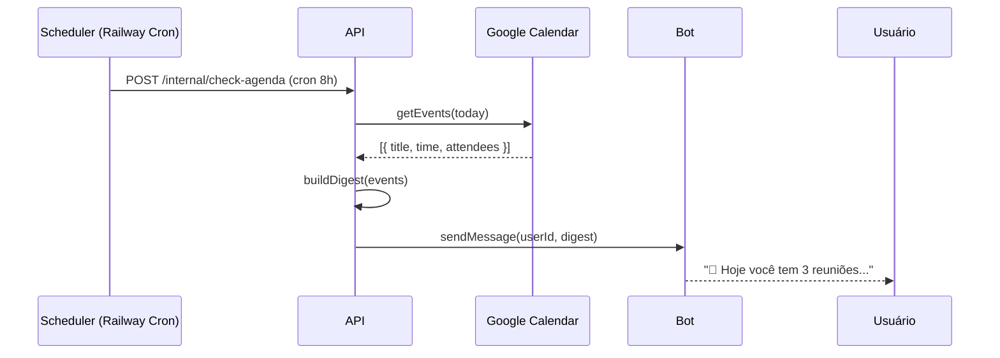
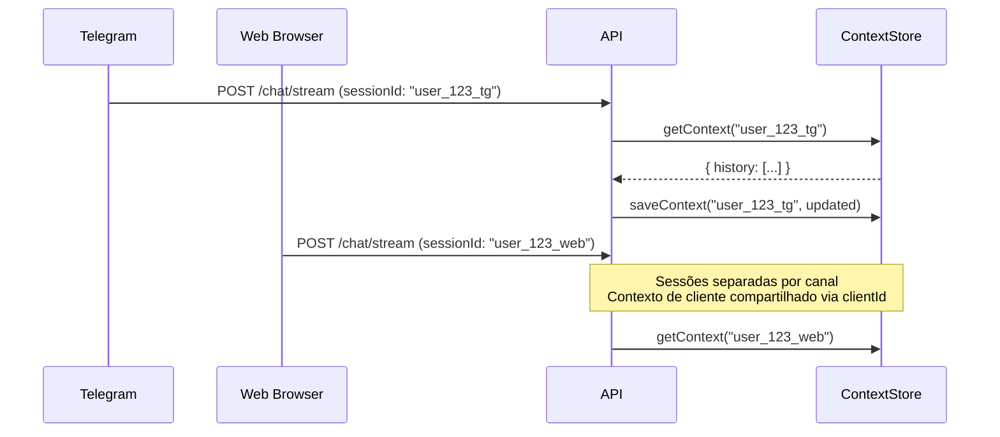

# ARIA — Full-Stack Architecture Document
**Version:** 1.0
**Status:** Approved
**Author:** @architect (Aria)
**Date:** 2026-02-20
**Project:** ARIA — AI Personal Assistant

---

## Section 1: Introduction

### 1.1 Project Overview
ARIA é um assistente pessoal de IA acessível via **Telegram Bot** e **Web UI**, focado em automação de rotina de trabalho: gestão de clientes, criação de tarefas, calendário, relatórios e análise de documentos.

### 1.2 Architecture Style
- **Pattern:** Monorepo com Turborepo (npm workspaces)
- **Type:** Greenfield — novo projeto do zero
- **Stack Base:** T3-inspired (Next.js 15 + TypeScript + TailwindCSS) + Fastify backend
- **Deploy:** Vercel (Web UI) + Railway (API + Bot)

### 1.3 Architecture Principles
1. **Separation of Concerns** — Web UI, API e Bot como apps independentes com lógica core compartilhada
2. **Streaming First** — SSE para respostas AI, feedback visual imediato
3. **Security by Default** — Autenticação em todas as camadas desde o início
4. **Fail Fast** — Validação de env vars na inicialização, erros descritivos
5. **Developer Experience** — Turbo pipeline, scripts granulares, TypeScript strict mode

---

## Section 2: High-Level Architecture

### 2.1 Deployment Diagram

```
┌─────────────────────────────────────────────────────────────────┐
│                        USERS                                    │
│              Browser ────────── Telegram App                    │
└──────────────────┬───────────────────┬──────────────────────────┘
                   │ HTTPS             │ Bot API
                   ▼                   ▼
┌──────────────────┴───┐   ┌───────────┴──────────────────────────┐
│   VERCEL (Edge CDN)  │   │         RAILWAY                      │
│                      │   │  ┌─────────────┐  ┌───────────────┐  │
│   Next.js 15 Web UI  │   │  │ Fastify API │  │ grammy.js Bot │  │
│   - SSR/RSC          │   │  │ :3001       │  │               │  │
│   - Three.js Orb     │   │  └──────┬──────┘  └──────┬────────┘  │
│   - Zustand State    │   │         │                 │           │
└──────────────────────┘   └─────────┼─────────────────┼──────────┘
                                     │                 │
                         ┌───────────▼─────────────────▼───────────┐
                         │         EXTERNAL SERVICES                │
                         │  Claude API  │  Whisper  │  Notion API  │
                         │  ClickUp API │  Google Calendar          │
                         └──────────────────────────────────────────┘
```

### 2.2 Architectural Patterns
1. **Monorepo** — apps/* + packages/* com workspaces
2. **Shared Core** — Business logic em packages/core, reutilizada por API e Bot
3. **SSE Streaming** — Respostas AI em tempo real sem WebSocket overhead
4. **Intent-First AI** — Parse de intenção com Haiku (rápido/barato) antes do processamento
5. **Rolling Context** — Janela de 10 mensagens para manter custo de tokens controlado
6. **Webhook (prod) / Polling (dev)** — Telegram bot adapta conforme ambiente

---

## Section 3: Tech Stack

| Layer | Technology | Version | Purpose |
|-------|-----------|---------|---------|
| **Web Framework** | Next.js | 15.x | Web UI com App Router + RSC |
| **Bot Framework** | grammy.js | 1.x | Telegram bot |
| **API Framework** | Fastify | 4.x | Backend REST API |
| **Language** | TypeScript | 5.4+ | Todo o projeto |
| **Styling** | TailwindCSS | 3.x | Utility-first CSS |
| **UI Components** | shadcn/ui | latest | Primitivos acessíveis |
| **3D / Animation** | Three.js + Framer Motion | latest | FluidOrb + transições |
| **State Management** | Zustand | 4.x | Client state (Web UI) |
| **AI — Main** | Claude API (claude-sonnet-4-6) | latest | Respostas principais |
| **AI — Intent** | Claude API (claude-haiku-4-5) | latest | Classificação rápida |
| **AI — Audio** | OpenAI Whisper API | v1 | Transcrição de áudio |
| **Notion** | @notionhq/client | latest | CRM de clientes |
| **ClickUp** | REST API v2 | v2 | Criação de tarefas |
| **Google Calendar** | googleapis | latest | Agendamentos |
| **Doc Parsing** | pdf-parse + mammoth | latest | PDF e DOCX |
| **Validation** | Zod | 3.x | Schema validation |
| **Testing** | Vitest + Playwright | latest | Unit + E2E |
| **Build** | Turborepo | 2.x | Monorepo pipeline |
| **Logging** | Pino | 8.x | Structured JSON logs |
| **Auth** | JWT + NextAuth.js | latest | Web UI auth |
| **Security** | Helmet.js + @fastify/rate-limit | latest | HTTP security |
| **Deploy: Web** | Vercel | — | Edge CDN + auto-deploy |
| **Deploy: API/Bot** | Railway | — | Container hosting |
| **CI/CD** | GitHub Actions | — | Quality gates + deploy |

---

## Section 4: Data Models

```typescript
// packages/shared/src/types/session.types.ts

export interface SessionContext {
  sessionId: string;
  userId: string;                    // Telegram ID ou JWT sub
  channel: 'telegram' | 'web';
  history: ConversationMessage[];    // Rolling window — últimas 10
  activeClientId?: string;           // Cliente em foco
  createdAt: Date;
  updatedAt: Date;
}

export interface ConversationMessage {
  role: 'user' | 'assistant';
  content: string;
  timestamp: Date;
  metadata?: {
    intent?: string;
    processingTimeMs?: number;
  };
}

export interface Message {
  id: string;
  sessionId: string;
  role: 'user' | 'assistant';
  content: string;
  contentType: 'text' | 'audio_transcript' | 'document_summary';
  timestamp: Date;
  tokens?: number;
}

export interface ParsedCommand {
  intent: IntentType;
  confidence: number;               // 0.0 — 1.0
  entities: Record<string, string>; // Ex: { clientName: "João", dueDate: "2026-03-01" }
  requiresConfirmation: boolean;
  rawText: string;
}

export type IntentType =
  | 'TASK_CREATE'
  | 'TASK_LIST'
  | 'CLIENT_LOOKUP'
  | 'CLIENT_UPDATE'
  | 'PLAN_OF_ATTACK_CREATE'
  | 'PLAN_OF_ATTACK_UPDATE'
  | 'CALENDAR_CREATE'
  | 'CALENDAR_LIST'
  | 'DOCUMENT_ANALYZE'
  | 'GENERAL_CHAT';

// packages/shared/src/types/client.types.ts

export interface ClientRef {
  id: string;
  name: string;
  notionPageId: string;
  clickupListId?: string;
}

export interface ClientProfile extends ClientRef {
  email?: string;
  phone?: string;
  company?: string;
  planOfAttack?: PlanOfAttack;
  recentTasks: TaskRef[];
  nextMeeting?: CalendarEvent;
  tags: string[];
  createdAt: Date;
  updatedAt: Date;
}

export interface PlanOfAttack {
  clientId: string;
  notionPageId: string;
  objectives: string[];
  nextActions: ActionItem[];
  status: 'active' | 'completed' | 'paused';
  updatedAt: Date;
}

export interface ActionItem {
  id: string;
  description: string;
  priority: 'high' | 'medium' | 'low';
  dueDate?: Date;
  completed: boolean;
}

// packages/shared/src/types/document.types.ts

export interface ProcessedDocument {
  id: string;
  originalName: string;
  mimeType: 'application/pdf' | 'application/vnd.openxmlformats-officedocument.wordprocessingml.document';
  extractedText: string;
  summary?: string;               // Gerado pela IA
  clientId?: string;              // Se associado a um cliente
  uploadedAt: Date;
  processedAt?: Date;
}
```

---

## Section 5: API Specification

### 5.1 Base URL
```
Development: http://localhost:3001/api
Production:  https://aria-api.railway.app/api
```

### 5.2 Auth Header
```
Authorization: Bearer <jwt-token>
Cookie: aria-token=<jwt-token>   (Web UI — httpOnly)
```

### 5.3 Endpoints

#### Chat
| Method | Endpoint | Description |
|--------|---------|-------------|
| POST | `/chat/message` | Mensagem texto — resposta completa |
| POST | `/chat/stream` | Mensagem texto — SSE streaming |
| GET | `/chat/history/:sessionId` | Histórico da sessão |

#### Audio
| Method | Endpoint | Description |
|--------|---------|-------------|
| POST | `/audio/transcribe` | Upload áudio → texto (Whisper) |
| POST | `/audio/process` | Transcrever + processar como comando |

#### Clients
| Method | Endpoint | Description |
|--------|---------|-------------|
| GET | `/clients` | Listar clientes (cache Notion) |
| GET | `/clients/:id` | Perfil completo do cliente |
| POST | `/clients` | Criar cliente (Notion + local) |
| PATCH | `/clients/:id` | Atualizar dados do cliente |
| GET | `/clients/:id/plan-of-attack` | Plano de ataque do cliente |
| PUT | `/clients/:id/plan-of-attack` | Atualizar plano de ataque |

#### Documents
| Method | Endpoint | Description |
|--------|---------|-------------|
| POST | `/documents/upload` | Upload PDF/DOCX → parse + summary |
| GET | `/documents/:id` | Resultado do processamento |

#### Tasks
| Method | Endpoint | Description |
|--------|---------|-------------|
| POST | `/tasks` | Criar tarefa no ClickUp |
| GET | `/tasks` | Listar tarefas (filtros: client, status) |

#### Calendar
| Method | Endpoint | Description |
|--------|---------|-------------|
| GET | `/calendar/events` | Eventos próximos (Google Calendar) |
| POST | `/calendar/events` | Criar evento |

#### System
| Method | Endpoint | Description |
|--------|---------|-------------|
| GET | `/health` | Health check (público) |

### 5.4 SSE Streaming Format
```
POST /api/chat/stream
Content-Type: application/json

{ "content": "cria uma tarefa de follow-up com João", "sessionId": "sess_abc123" }

Response (text/event-stream):
data: {"type":"chunk","content":"Claro! "}
data: {"type":"chunk","content":"Criando tarefa "}
data: {"type":"chunk","content":"de follow-up..."}
data: {"type":"action","action":"TASK_CREATED","taskId":"task_xyz"}
data: {"type":"done","totalTokens":142}
```

### 5.5 Error Codes por Domínio
```
AUTH_001 — Unauthorized (token ausente)
AUTH_002 — Token inválido ou expirado
AUTH_003 — Rate limit excedido
AUTH_004 — Telegram ID não autorizado

AI_001   — Claude API indisponível
AI_002   — Context window excedido
AI_003   — Falha no intent parsing

NOTION_001 — Erro na Notion API
NOTION_002 — Database não encontrado
CLICKUP_001 — Erro na ClickUp API
GCAL_001   — Google Calendar auth expirado

DOC_001 — Tipo de arquivo não suportado
DOC_002 — Arquivo excede 20MB
DOC_003 — Parse falhou (arquivo corrompido)

INTERNAL_001 — Erro interno inesperado
```

---

## Section 6: Core Workflows

### 6.1 Plano de Ataque



### 6.2 Audio Command



### 6.3 Web UI Auth



### 6.4 Proactive Notifications



### 6.5 Unified Context (Web + Telegram)



---

## Section 7: Frontend Architecture

### 7.1 Component Structure

```
apps/web/src/
├── app/                          # Next.js 15 App Router
│   ├── (auth)/
│   │   └── login/page.tsx
│   ├── (dashboard)/
│   │   ├── layout.tsx
│   │   ├── page.tsx
│   │   ├── clients/
│   │   │   ├── page.tsx
│   │   │   └── [id]/page.tsx
│   │   ├── tasks/page.tsx
│   │   └── reports/page.tsx
│   ├── api/
│   │   └── auth/[...nextauth]/route.ts
│   ├── globals.css
│   └── layout.tsx
│
├── components/
│   ├── ui/                       # shadcn/ui primitives
│   ├── aria/
│   │   ├── FluidOrb/
│   │   │   ├── FluidOrb.tsx
│   │   │   ├── orb-states.ts
│   │   │   └── shaders/
│   │   ├── ChatInterface/
│   │   │   ├── ChatInterface.tsx
│   │   │   ├── MessageList.tsx
│   │   │   ├── MessageBubble.tsx
│   │   │   ├── InputBar.tsx
│   │   │   └── StreamingMessage.tsx
│   │   ├── ClientCard/
│   │   ├── AudioRecorder/
│   │   └── NotionEmbed/
│   └── layout/
│       ├── Sidebar.tsx
│       ├── Header.tsx
│       └── GlassPanel.tsx
│
├── hooks/
│   ├── useChat.ts
│   ├── useClients.ts
│   ├── useAudioInput.ts
│   └── useOrbState.ts
│
├── stores/
│   ├── chatStore.ts
│   ├── uiStore.ts
│   └── clientStore.ts
│
├── services/
│   ├── api.ts
│   ├── chat.service.ts
│   ├── client.service.ts
│   └── audio.service.ts
│
├── lib/
│   ├── utils.ts
│   ├── constants.ts
│   └── markdown.ts
│
└── types/
    └── index.ts
```

### 7.2 State Management (Zustand)

```typescript
interface ChatStore {
  messages: Message[];
  isStreaming: boolean;
  streamingContent: string;
  sessionContext: SessionContext | null;
  addMessage: (msg: Message) => void;
  setStreaming: (streaming: boolean) => void;
  appendStreamChunk: (chunk: string) => void;
  commitStreamedMessage: () => void;
  setSessionContext: (ctx: SessionContext) => void;
}

interface UIStore {
  orbState: OrbState;
  sidebarOpen: boolean;
  activeModal: string | null;
  setOrbState: (state: OrbState) => void;
  toggleSidebar: () => void;
  openModal: (id: string) => void;
  closeModal: () => void;
}
```

### 7.3 SSE Streaming Hook

```typescript
export function useChat() {
  const { appendStreamChunk, commitStreamedMessage, setStreaming } = useChatStore();
  const { setOrbState } = useUIStore();

  const sendMessage = async (content: string) => {
    setOrbState('processing');
    setStreaming(true);
    try {
      for await (const chunk of streamMessage(content, sessionContext)) {
        appendStreamChunk(chunk);
        setOrbState('responding');
      }
      commitStreamedMessage();
      setOrbState('success');
    } catch {
      setOrbState('error');
    } finally {
      setStreaming(false);
      setTimeout(() => setOrbState('idle'), 1500);
    }
  };

  return { sendMessage };
}
```

### 7.4 FluidOrb States

```typescript
export const ORB_CONFIGS: Record<OrbState, OrbConfig> = {
  idle:       { color: '#6366F1', speed: 0.3, scale: 1.0,  blur: 20 },
  listening:  { color: '#8B5CF6', speed: 1.2, scale: 1.15, blur: 25 },
  processing: { color: '#A78BFA', speed: 2.0, scale: 1.1,  blur: 30 },
  responding: { color: '#7C3AED', speed: 1.5, scale: 1.2,  blur: 22 },
  success:    { color: '#10B981', speed: 0.5, scale: 1.05, blur: 18 },
  error:      { color: '#EF4444', speed: 0.8, scale: 1.0,  blur: 20 },
};
```

---

## Section 8: Backend Architecture

### 8.1 Service Structure

```
apps/api/src/
├── server.ts
├── config/
│   ├── env.ts
│   └── constants.ts
├── plugins/
│   ├── auth.plugin.ts
│   ├── cors.plugin.ts
│   ├── helmet.plugin.ts
│   ├── rate-limit.plugin.ts
│   └── swagger.plugin.ts
├── modules/
│   ├── chat/
│   ├── clients/
│   ├── audio/
│   ├── documents/
│   ├── tasks/
│   └── calendar/
├── shared/
│   ├── middleware/
│   ├── errors/
│   └── logger.ts
└── types/
    └── fastify.d.ts
```

### 8.2 AI Orchestration

```typescript
export class ChatService {
  async *streamResponse(userMessage: string, sessionId: string): AsyncGenerator<string> {
    const context = await this.contextStore.get(sessionId);
    const intent = await this.parseIntent(userMessage);
    const enrichedContext = await this.enrichContext(intent, context);

    const stream = this.claude.messages.stream({
      model: 'claude-sonnet-4-6',
      max_tokens: 4096,
      system: this.buildSystemPrompt(enrichedContext),
      messages: [
        ...context.history.slice(-10),
        { role: 'user', content: userMessage }
      ],
    });

    let fullResponse = '';
    for await (const chunk of stream) {
      if (chunk.type === 'content_block_delta') {
        fullResponse += chunk.delta.text;
        yield chunk.delta.text;
      }
    }

    await this.contextStore.append(sessionId, { user: userMessage, assistant: fullResponse });
    await this.executeSideEffects(intent, fullResponse);
  }
}
```

### 8.3 Auth Strategy

| Canal | Método | Detalhes |
|-------|--------|----------|
| Web UI | JWT httpOnly cookie | NextAuth.js, 7d expiry, refresh token |
| Telegram | ID Whitelist | `ALLOWED_TELEGRAM_IDS` env var |
| API | Bearer token | Gerado no login Web, validado pelo Fastify plugin |

---

## Section 9: Unified Project Structure

```
aria/
├── package.json                         # npm workspaces
├── turbo.json                           # Turborepo pipeline
├── tsconfig.base.json
├── .env.example
│
├── apps/
│   ├── web/                             # Next.js 15
│   ├── api/                             # Fastify
│   └── bot/                             # grammy.js
│
├── packages/
│   ├── core/                            # Business logic compartilhada
│   │   └── src/
│   │       ├── chat/
│   │       │   ├── ChatService.ts
│   │       │   ├── ContextStore.ts
│   │       │   └── IntentParser.ts
│   │       ├── ai/
│   │       │   ├── claude.client.ts
│   │       │   └── whisper.client.ts
│   │       └── documents/
│   │           ├── PdfParser.ts
│   │           └── DocxParser.ts
│   │
│   ├── integrations/                    # Clientes APIs externas
│   │   └── src/
│   │       ├── notion/
│   │       ├── clickup/
│   │       └── google/
│   │
│   └── shared/                          # Tipos e utils universais
│       └── src/
│           ├── types/
│           ├── errors/
│           └── utils/
│
├── docs/
│   ├── prd.md
│   └── architecture.md
│
└── scripts/
    ├── setup.sh
    └── seed-notion.ts
```

---

## Section 10: Development Workflow

### 10.1 Setup Local

```bash
git clone https://github.com/seu-user/aria.git
cd aria
npm install
cp .env.example .env
# Editar .env com suas chaves
npm run dev
```

### 10.2 .env.example

```bash
# AI
ANTHROPIC_API_KEY=sk-ant-...
OPENAI_API_KEY=sk-...

# Telegram
TELEGRAM_BOT_TOKEN=...
ALLOWED_TELEGRAM_IDS=123456789

# Auth
NEXTAUTH_SECRET=...
NEXTAUTH_URL=http://localhost:3000
JWT_SECRET=...

# Integrations
NOTION_API_KEY=secret_...
NOTION_DATABASE_ID=...
CLICKUP_API_KEY=pk_...
CLICKUP_TEAM_ID=...
GOOGLE_CLIENT_ID=...
GOOGLE_CLIENT_SECRET=...
GOOGLE_REFRESH_TOKEN=...

# App
API_URL=http://localhost:3001
NODE_ENV=development
LOG_LEVEL=debug
```

### 10.3 Scripts

```bash
npm run dev          # Todos os apps
npm run dev:web      # Apenas Web UI
npm run dev:api      # Apenas API
npm run dev:bot      # Apenas Bot
npm run lint         # ESLint
npm run typecheck    # tsc --noEmit
npm test             # Vitest
npm run build        # Build completo
```

### 10.4 Git Workflow

```
main        # Produção (protegida)
├── develop # Integração
│   ├── feat/aria-chat-streaming
│   └── fix/telegram-voice-handler
```

**Commits:** `feat: implement SSE streaming [Epic 1]`

---

## Section 11: Deployment Architecture

### 11.1 Environments

| Ambiente | Web (Vercel) | API + Bot (Railway) |
|----------|-------------|---------------------|
| Preview | PR automático | Branch deploy |
| Staging | `develop` branch | `develop` branch |
| Production | `main` branch | `main` branch |

### 11.2 GitHub Actions CI/CD

```yaml
name: CI
on:
  push:
    branches: [main, develop]
  pull_request:

jobs:
  quality:
    runs-on: ubuntu-latest
    steps:
      - uses: actions/checkout@v4
      - uses: actions/setup-node@v4
        with: { node-version: 20, cache: npm }
      - run: npm ci
      - run: npm run typecheck
      - run: npm run lint
      - run: npm test

  deploy-api:
    needs: quality
    if: github.ref == 'refs/heads/main'
    uses: railway/deploy-action@v1
    with: { service: aria-api, token: ${{ secrets.RAILWAY_TOKEN }} }

  deploy-bot:
    needs: quality
    if: github.ref == 'refs/heads/main'
    uses: railway/deploy-action@v1
    with: { service: aria-bot, token: ${{ secrets.RAILWAY_TOKEN }} }
```

---

## Section 12: Security & Performance

### 12.1 Security Layers

```
Internet → TLS → Rate Limiter → Helmet → CORS → Auth Plugin → Zod Validation → Business Logic
```

### 12.2 Rate Limiting

```typescript
await fastify.register(import('@fastify/rate-limit'), {
  max: 30,
  timeWindow: '1 minute',
  keyGenerator: (req) => req.headers['x-user-id'] as string || req.ip,
});
```

### 12.3 Performance Strategies

| Área | Estratégia |
|------|-----------|
| AI Response | SSE streaming — primeiro token < 500ms percebido |
| Intent Parsing | claude-haiku-4-5 — modelo leve para classificação |
| Contexto | Rolling window 10 mensagens |
| Notion | Cache in-memory 5min |
| Web UI | Next.js RSC para dados estáticos |
| Three.js Orb | Lazy load após hydration |

### 12.4 Env Validation

```typescript
const envSchema = z.object({
  ANTHROPIC_API_KEY: z.string().min(1),
  JWT_SECRET: z.string().min(32),
  // ... todas as vars obrigatórias
});
export const env = envSchema.parse(process.env); // Falha em startup se inválido
```

---

## Section 13: Testing Strategy

### 13.1 Pyramid

```
    /E2E\        Playwright — login, chat, plano de ataque
   /Integ \      Vitest — services com mocks de APIs externas
  / Unit   \     Vitest — parsers, utils, funções puras
```

### 13.2 Coverage by Module

| Módulo | Tipo | Foco |
|--------|------|------|
| IntentParser | Unit | 10+ intenções classificadas corretamente |
| PdfParser / DocxParser | Unit | Extração, edge cases |
| ChatService | Integration | Stream com Claude mock, contexto |
| NotionClient | Integration | Sync, formatação Plano de Ataque |
| Auth Plugin | Integration | JWT válido/expirado, whitelist |
| Chat Flow | E2E | Mensagem → resposta streamed na UI |

---

## Section 14: Coding Standards

### 14.1 Naming Conventions

| Elemento | Convenção | Exemplo |
|----------|-----------|---------|
| Componentes | PascalCase | `FluidOrb.tsx` |
| Services / Hooks | camelCase | `chat.service.ts`, `useChat.ts` |
| Classes | PascalCase | `ChatService` |
| Constantes globais | UPPER_SNAKE_CASE | `MAX_CONTEXT_MESSAGES` |
| Rotas API | kebab-case | `/api/plan-of-attack` |

### 14.2 TypeScript Config

```json
{
  "strict": true,
  "noUncheckedIndexedAccess": true,
  "exactOptionalPropertyTypes": true,
  "noImplicitOverride": true
}
```

---

## Section 15: Error Handling

### 15.1 AppError

```typescript
export class AppError extends Error {
  constructor(
    message: string,
    public readonly code: string,
    public readonly options?: { statusCode?: number; cause?: unknown }
  ) {
    super(message, { cause: options?.cause });
  }
}
```

### 15.2 Global Handler (Fastify)

```typescript
fastify.setErrorHandler((error, req, reply) => {
  if (error instanceof AppError) {
    return reply.code(error.options?.statusCode ?? 400).send(error.toJSON());
  }
  req.log.error({ err: error }, 'Unhandled error');
  return reply.code(500).send({ error: 'Internal server error', code: 'INTERNAL_001' });
});
```

---

## Section 16: Monitoring & Observability

| Ferramenta | Propósito |
|-----------|-----------|
| Pino | Structured JSON logging |
| Railway Metrics | CPU, RAM, requests por serviço |
| Vercel Analytics | Web Vitals, page views |
| Sentry (futuro) | Error tracking |

```typescript
export const logger = pino({
  level: env.LOG_LEVEL,
  transport: env.NODE_ENV === 'development'
    ? { target: 'pino-pretty', options: { colorize: true } }
    : undefined,
});
```

---

## Section 17: Checklist Results

```
✅ Scalability       — Monorepo com workspaces, Railway auto-scale, Vercel Edge
✅ Security          — JWT httpOnly, Telegram whitelist, Helmet, Rate limit, Zod validation
✅ Performance       — SSE streaming, Haiku para intent, rolling context window, CDN
✅ Maintainability   — Módulos encapsulados, shared packages, naming conventions
✅ Testability       — Unit + Integration + E2E pyramid, mocks definidos
✅ Observability     — Pino structured logging, Railway Metrics, Vercel Analytics
✅ Error Handling    — AppError base class, global handler, error codes por domínio
✅ CI/CD             — GitHub Actions → Vercel (auto) + Railway deploy
✅ Dev Experience    — Turborepo, env validation startup, scripts individuais por app
✅ NFR Coverage      — NFR1-NFR14 do PRD todos cobertos

Score: 10/10 ✅ — APPROVED, ready for @sm story creation
```

---

*— Aria, arquitetando o futuro 🏗️*
*ARIA Architecture v1.0 — 2026-02-20*
