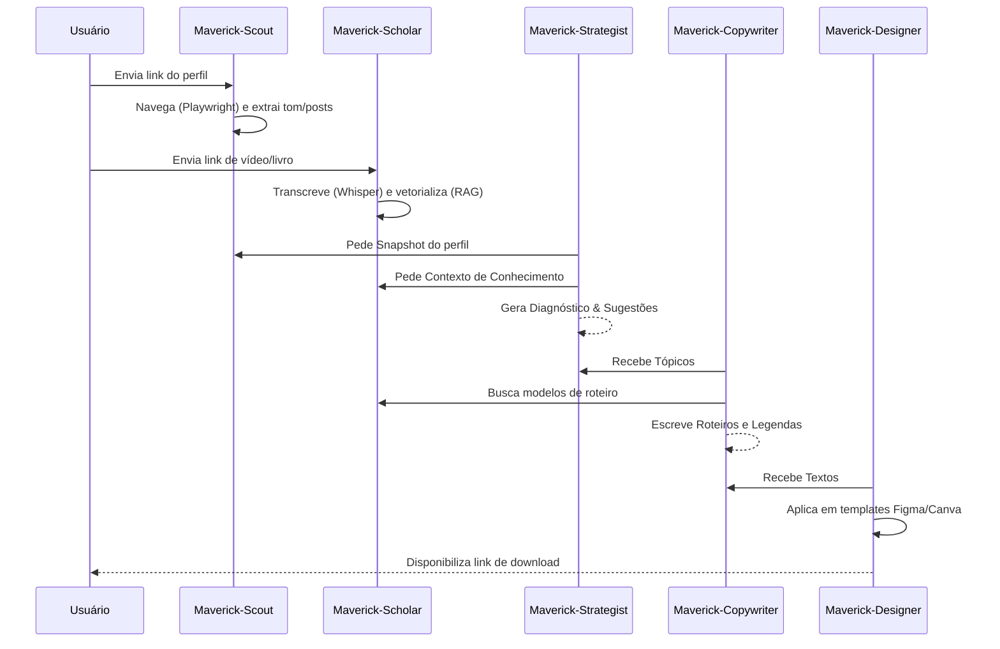

# MAVERICK — AI Content Creation Squad Architecture
**Version:** 1.0
**Status:** Approved
**Author:** @architect (Aria)
**Date:** 2026-02-20
**Project:** MAVERICK — AI Content Creation Squad

---

## Section 1: Introduction

### 1.1 Project Overview
MAVERICK é uma Squad de agentes especializados em **Criação de Conteúdo Estratégico**. Ele analisa perfis sociais, processa bases de conhecimento profundas (livros, vídeos, transcrições), gera diagnósticos comparativos e produz roteiros e artes visuais (Figma/Canva) de forma automatizada.

### 1.2 Architecture Style
- **Pattern:** Monorepo com Turborepo (npm workspaces)
- **Type:** Greenfield / AIOS Squad
- **Stack Base:** Next.js 15 (Dashboard) + Fastify (Orchestration API) + Playwright (Scraping)
- **RAG Engine:** LangChain + pgvector + Claude-Sonnet-4-6

---

## Section 2: High-Level Architecture

### 2.1 Deployment Diagram

```
┌─────────────────────────────────────────────────────────────────┐
│                        USER (Erick)                             │
│              Dashboard ────────── Content Delivery              │
└──────────────────┬───────────────────┬──────────────────────────┘
                   │                   │
                   ▼                   ▼
┌─────────────────────────────────────────────────────────────────┐
│                   MAVERICK SQUAD (AIOS Core)                    │
│  ┌──────────────┐  ┌──────────────┐  ┌──────────────┐           │
│  │    SCOUT     │  │   SCHOLAR    │  │  STRATEGIST  │           │
│  │ (Social Web) │  │ (RAG Engine) │  │ (Brain/Diag) │           │
│  └──────┬───────┘  └──────┬───────┘  └──────┬───────┘           │
│         │                 │                 │                   │
│         ▼                 ▼                 ▼                   │
│  ┌──────────────┐  ┌──────────────┐  ┌──────────────┐           │
│  │  COPYWRITER  │  │   DESIGNER   │  │  DELIVERER   │           │
│  │ (Scripts)    │  │ (Figma/Can)  │  │ (Package)    │           │
│  └──────┬───────┘  └──────┬───────┘  └──────┬───────┘           │
└─────────┼─────────────────┼─────────────────┼───────────────────┘
          │                 │                 │
┌─────────▼─────────────────▼─────────────────▼───────────────────┐
│         EXTERNAL SERVICES & APIS                                │
│  Instagram (Scraping) │ YouTube (Transcript) │ Figma API         │
│  Canva SDK            │ OpenAI Whisper       │ Vector DB        │
└─────────────────────────────────────────────────────────────────┘
```

### 2.2 Architectural Patterns
1. **RAG-Intensive** — Scholar mantém o estado de conhecimento vetorializado.
2. **Scraper-as-a-Service** — Scout usa Playwright para navegar em perfis dinâmicos.
3. **Template-Driven Design** — Designer consome referências de design enviadas pelo usuário para clonar estilos no Figma/Canva.
4. **Task-First Orchestration** — Fluxos síncronos e assíncronos coordenados pelo AIOS Master.

---

## Section 3: Tech Stack

| Layer | Technology | Version | Purpose |
|-------|-----------|---------|---------|
| **Framework** | Next.js | 15.x | Dashboard de Conteúdo |
| **API** | Fastify | 4.x | Backend de Orquestração |
| **Scraping** | Playwright | latest | Navegação Social (Scout) |
| **RAG** | LangChain | latest | Gestão de Conhecimento (Scholar) |
| **Database** | PostgreSQL + pgvector | latest | Armazenamento de Vetores e Perfis |
| **Design** | Figma REST API | v1 | Geração Automática de Artes |
| **Design** | Canva Connect API | latest | Geração de Artes em Nuvem |
| **Video AI** | yt-dlp + Whisper | latest | Transcrição e Análise de Vídeo |

---

## Section 4: Core Workflows

### 4.1 Maverick-Content-Loop



---

## Section 5: Security & Standards

### 5.1 Privacy
- Os dados de perfil extraídos são usados apenas para diagnóstico local.
- Chaves de API do Figma/Canva devem estar protegidas no `.env.local`.

### 5.2 Performance
- O processamento de vídeos (Transcrição RAG) será executado em background para não travar o dashboard.
- Geração de artes visuais usará filas (queues) para lidar com rate limits das APIs de Design.

---

*— Aria, arquitetando o futuro do conteúdo 🏗️🎯*
*MAVERICK Architecture v1.0 — 2026-02-20*
